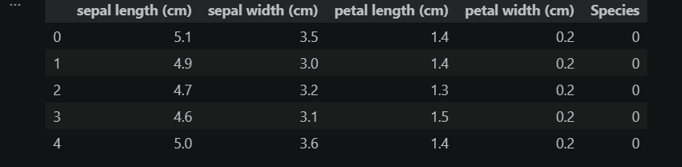
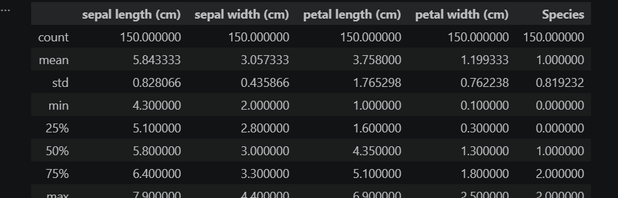
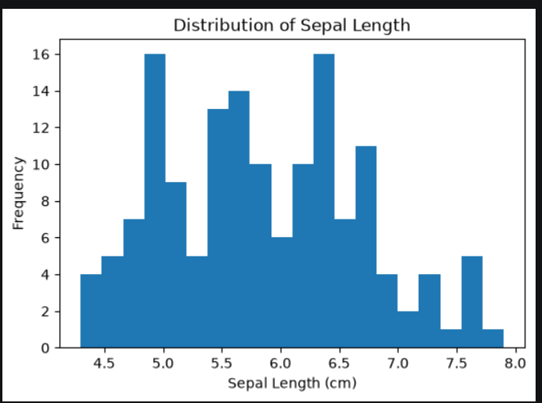
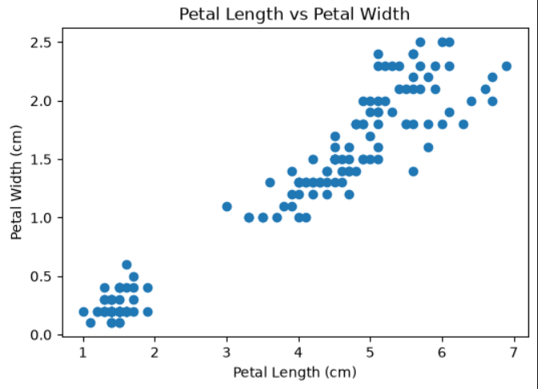
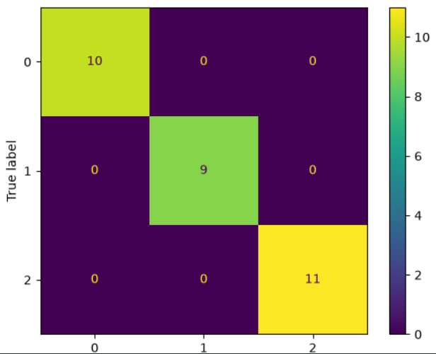

# 🌸 Iris Flower Classification using Machine Learning

A Machine Learning project that classifies Iris flowers into three different species using the **Logistic Regression** algorithm. The project demonstrates the complete machine learning workflow, including data exploration, visualization, model training, and performance evaluation.

---

## 📌 Project Overview

The objective of this project is to classify Iris flowers into one of the following species:

- Setosa
- Versicolor
- Virginica

The model is trained using the famous **Scikit-learn Iris Dataset** and achieves high prediction accuracy.

---

## 📂 Dataset Information

- **Dataset:** Iris Dataset (Scikit-learn)
- **Total Samples:** 150
- **Features:** 4
- **Classes:** 3

### Features

- Sepal Length (cm)
- Sepal Width (cm)
- Petal Length (cm)
- Petal Width (cm)

---

## 📊 Exploratory Data Analysis (EDA)

The notebook includes:

- Dataset exploration
- Data summary
- Missing value analysis
- Feature distribution
- Scatter plot visualization

---

## 🤖 Machine Learning Model

**Algorithm Used**

- Logistic Regression

### Workflow

- Load Dataset
- Data Preprocessing
- Train-Test Split
- Model Training
- Prediction
- Model Evaluation

---

## 📈 Results

- **Model Accuracy:** **96.67%**

The model successfully classifies Iris flowers with high accuracy.

---

## 🛠️ Tech Stack

- Python
- Pandas
- NumPy
- Matplotlib
- Scikit-learn
- Jupyter Notebook

---

## 📁 Project Structure

```text
iris-classification/
│── Iris_classification.ipynb
│── iris.csv
│── requirements.txt
│── README.md
│── .gitignore
│── screenshots/
```

---

## 📸 Screenshots

### Dataset Preview



### Exploratory Data Analysis



### Histogram



### Scatter Plot



### Confusion Matrix



## 🚀 How to Run

1. Clone the repository

```bash
git clone https://github.com/Rima-005/iris-classification.git
```

2. Install dependencies

```bash
pip install -r requirements.txt
```

3. Open the notebook

```bash
jupyter notebook
```

4. Run all cells.

---

## 🔮 Future Improvements

- Compare multiple Machine Learning algorithms
- Perform advanced feature engineering
- Deploy the model using Flask
- Improve visualizations

---


If you found this project helpful, feel free to ⭐ the repository.